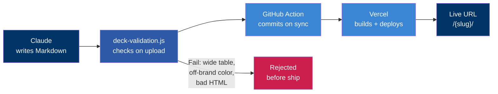

# AI Presentation Pipeline
A proof of concept: LLM authoring, code-enforced brand, zero manual PowerPoint

---
layout: default
---

# The Hidden Tax on GTM Speed

Research gets done. Data looks good. Competitive intel is solid.

Then it sits, waiting for someone to open PowerPoint.

The bottleneck is not the thinking.

It is the presentation layer.

When deck production is slow, high-quality research sits. Campaigns stall. Sales conversations are under-equipped.

1

Content exists

Research, data, competitive intel

⏱

The gap

Copy, reformat, rebrand, export, resend

2

Content lands

In front of the right person

Speed is leverage. That gap costs more than it appears.

---
layout: default
---

# The Traditional Loop

Gather

Research brief lands in inbox

→

Format

Copy into slides, fight the template

→

Rebrand

Fix logo, fix navy, fix font

→

Export

PDF, email link, link expires

→

Repeat

When anything changes

Better templates do not solve this.

Someone still has to manually move content into the format. That someone is usually not the person who created it.

---
layout: default
---

# The Hypothesis: Brand as Code

The old assumption

✗

Brand review is a human step at the end

✗

Designers are the brand guardrail

✗

AI output needs manual cleanup before sharing

The bet

✓

Brand enforcement lives in the repo, not in review cycles

✓

The model owns story and structure; code owns chrome

✓

Draft to live URL in minutes, not days of polish

Target outcome

Claude writes valid Markdown. The pipeline guarantees every slide gets the HG navy cover, footer, CONFIDENTIAL tag, and color tokens. No designer in the loop for any of that.

---
layout: default
---

# The Pipeline: Four Layers

1

<HgIcon name="ai-copilot" size="22px" />

AI Authoring via Structured Prompt

A 580-line system prompt defines the grammar the model must write within: allowed layouts, component names, table density limits, HTML composition rules. The model has creative latitude on content. Zero latitude on design.

2

<HgIcon name="ai-infrastructure" size="22px" />

Brand Enforcement via Slidev Theme

hg-theme/ is the brand in code. Cover slides get navy + logo + CONFIDENTIAL automatically. Default slides get the footer and slide number. The model cannot pick the wrong blue. The system prevents it.

3

<HgIcon name="config-wizard" size="22px" />

Validation as Guardrail

deck-validation.js runs on upload, Drive sync, and pre-build. Wide tables, off-brand colors, forbidden patterns: caught before they ship. The model does not have to remember every rule.

4

<HgIcon name="gtm-efficiency" size="22px" />

Automation Glue: Drive to Vercel

A GitHub Action polls Google Drive every 5 minutes. New deck file lands, action commits it, Vercel builds and deploys. Each deck gets its own URL. Zero-touch after the model writes valid Markdown.

---
layout: default
---

# What the Theme Enforces

Manual process

✗

Someone opens the PPTX template and drags the logo to the right corner

✗

They apply navy from memory, or eyeball it from the last deck

✗

Brand review happens after the fact, often skipped under deadline

✗

CONFIDENTIAL tag added manually, sometimes forgotten

Code-enforced brand

✓

layout: cover gives every first slide navy + logo + CONFIDENTIAL, always

✓

Color tokens (hg-navy, hg-royal, hg-medium) are the only available palette

✓

Off-brand hex values fail validation before the deck ever deploys

✓

Footer with copyright and slide numbers on every content slide, automatically

Brand is not a review step. It is a property of the build system.

---
layout: default
---

# What Broke in Production

Linux case sensitivity

public/ and Public/ are different directories on a case-sensitive filesystem. Works locally on macOS. Fails silently in CI. The error only surfaces in deployment.

Blank lines inside HTML blocks

Slidev ends HTML parsing at a blank line. Sibling divs after a blank line render as raw code. Invisible cause, obvious symptom. Now an explicit rule in the prompt with examples.

Table overflow on dense slides

A CRM export pasted into a six-column Markdown table overflows the canvas. Columns bleed. Text becomes unreadable. Required both a prompt rule (max 4 columns) and a CSS constraint.

Drive sync edge cases

Service account permissions, sync frequency, and token scoping interact in undocumented ways. Only surfaces in production. Required iteration on the integration, not just the code.

The system is done when output survives the full path from generation to deployment under real conditions. Not when it looks right in a demo.

---
layout: default
---

# Architecture: Prompt + Validator + Build = One System

Prompt is a grammar

Constrains output format, not creativity. The model writes within a narrow schema.

Validator catches drift

LLMs drift over time. Validation at the boundary is more reliable than prompting perfection.

Build is enforcement

The last gate before deployment. Prompt + validator + build work as one system, not three.

---
layout: default
---

# If This Scales

<HgIcon name="gtm-modernization" size="52px" />

Cowork Integration

The web-deck skill in Cowork already connects to this pipeline. Marketers and sales reps generate decks today, no CLI required. Scaling this path means UI for non-technical publishers.

<HgIcon name="ai-infrastructure" size="52px" />

Reference Architecture

The three-layer design (model, validator, deploy) applies to any structured output: reports, briefs, landing pages, email sequences. The question is whether to generalize the schema and validation layer into shared infrastructure.

<HgIcon name="invest-future" size="52px" />

Production Path

Making this a real internal tool requires a publishing UI, tighter error surfaces, and more robust sync. A meaningful investment. The value case depends on how often teams need branded decks fast, and what that loop actually costs today.

The immediate argument: use this as a model for how we build AI-assisted content systems going forward, not a mandate to scale this specific project immediately.

---
layout: default
---

# Honest Scope

What it is

+
Proof the pipeline works end-to-end

+
Branded web narratives: readouts, briefs, summaries, comparisons

+
Live today at 6 deck URLs via Vercel

+
Connected to Cowork via web-deck skill

What it is not

-
A replacement for PowerPoint everywhere

-
Production-ready without prompt discipline

-
Animated PPTX, embedded video, pixel-perfect design

-
A productized internal tool yet

What comes next

→
Non-technical publishing UI

→
Tighter validation that blocks, not just warns

→
Decision on whether to generalize the pipeline pattern

→
Onboarding so others can run this without a dev setup

---
layout: default
---

# Four Principles Worth Carrying Forward

1

Constrain the output format, not the creativity

Asking an LLM to "make a deck" produces inconsistent results. Asking it to produce Markdown that satisfies a grammar produces repeatable ones. The creative surface stays wide when the structural surface is narrow and enforced.

2

Brand is code

Logos, footers, color tokens, and slide numbers belong in a theme, not in a prompt instruction that can drift. When brand lives in code, it cannot be forgotten under deadline or ignored by a distracted model.

3

Treat prompt, validator, and build as one system

A good prompt without validation drifts. Validation without a clean prompt catches too many errors too late. A clean build with neither produces confident-looking garbage. They only work as a system.

4

Automation glue is what makes AI feel like a product

Drive sync + GitHub Actions + Vercel is what turns a capability into something a person can use without knowing what is happening. The engineering is not impressive. The result is.

